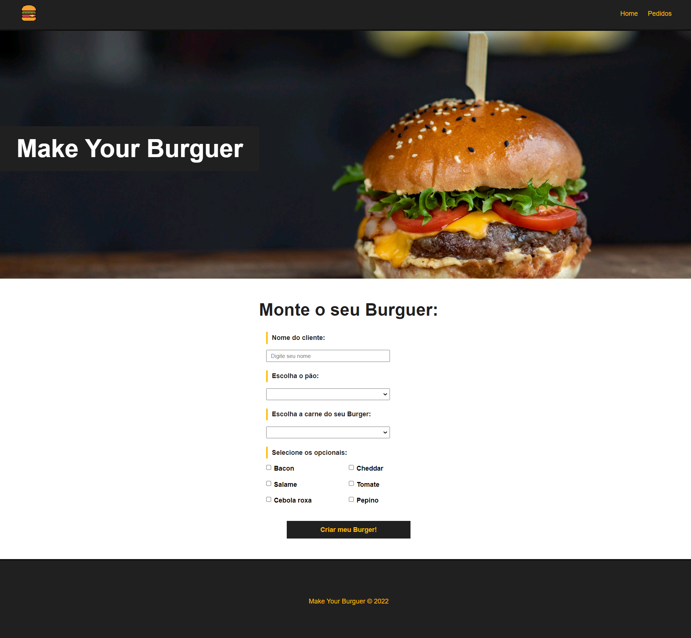
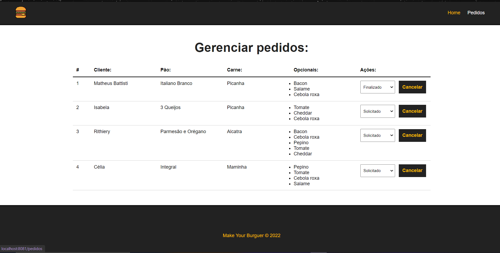

# Make Your Burguer :hamburger:

> ## :chart_with_upwards_trend: Objetivo do Projeto
    Esse projeto foi constuído através de um curso gratuito de Vue.js no youtube, feito por Matheus Battisti. E tem o propósito de praticar conhecimentos de HTML, CSS e JS, além de simular uma API REST com JSON Server. Afim de entender os conceitos backend, e aprender uma nova ferramenta de desenvolvimento para facilitar a produção, como o Vue.JS e Vue Router.

> ## :scroll: Resumo

 - :one: Página Principal - Home!
   
    A página principal consiste em anotar os pedidos dos clientes, através de um formuário, que pedirá o nome, o tipo de pão, a carne e os opcionais.  

 - :two: Página Gerenciamento de Pedidos - Pedidos! 
   
    Após cadastrados, os pedidos vem para a página de gerenciamento de pedidos. Lá os pedidos serão armazenados, como uma lista, podendo serem cancelados, ou possibilitando a mudança de seus status de produção.

> ## :wrench: Tecnologias
    - HTML
    - CSS
    - Javascript
    - Vue.js
    - Json Server
